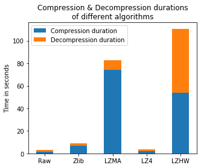
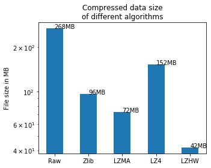

# Beyond Orion 


[](https://forthebadge.com) [](https://forthebadge.com) 

## About the project
### Traditional IoT compression schemes fail to:

1. Minimise energy consumption within IoT nodes
1. Provide high scalability
1. Ensure fault tolerance (resilence to errors)
1. Robustness
1. High complexity

**Data Frames compression and decompression can work in parallel**.

## Quick Start

```bash
pip install requirements.txt
```

```python
import lzhw

sample_data = ["Sunny", "Sunny", "Overcast", "Rain", "Rain", "Rain", "Overcast",
               "Sunny", "Sunny", "Rain", "Sunny", "Overcast", "Overcast", "Rain",
               "Rain", "Rain", "Sunny", "Sunny", "Overcaste"]

compressed = lzhw.LZHW(sample_data)
## let's see how the compressed object looks like:
print(compressed.compressed)
# (506460, 128794, 112504)

## its size
print(compressed.size())
# 72

## size of original
from sys import getsizeof
print(getsizeof(sample_data))
# 216

print(compressed.space_saving())
# space saving from original to compressed is 67%

## Let's decompress and check whether there is any information loss
decomp = compressed.decompress()
print(decomp == sample_data)
# True
```

As we saw, the LZHW class has saved 67% of the space used to store the original list without any loss. This percentage can get better with bigger data that may have repeated sequences.
The class has also some useful helper methods as **space_saving**, **size**, and **decompress()** to revert back to original.

Another example with numeric data.

```python
from random import sample, choices

numbers = choices(sample(range(0, 5), 5), k = 20)
comp_num = lzhw.LZHW(numbers)

print(getsizeof(numbers) > comp_num.size())
# True

print(numbers == list(map(int, comp_num.decompress()))) ## make it int again
# True

print(comp_num.space_saving())
# space saving from original to compressed is 73%
```

Let's look at how the compressed object is stored and how it looks like when printed:
LZHW class has an attribute called **compressed** which is a tuple of integers representing the encoded triplets.

```python
print(comp_num.compressed) # how the compressed is saved (as tuple of 3 integers)
# (8198555, 620206, 3059308)
```

We can also write the compressed data to files using **save_to_file** method,
and read it back and decompress it using **decompress_from_file** function.

```python
status = ["Good", "Bad", "Bad", "Bad", "Good", "Good", "Average", "Average", "Good",
          "Average", "Average", "Bad", "Average", "Good", "Bad", "Bad", "Good"]
comp_status = lzhw.LZHW(status)
comp_status.save_to_file("status.txt")
decomp_status = lzhw.decompress_from_file("status.txt")
print(status == decomp_status)
# True
```

## Compressing DataFrames (in Parallel)

lzhw doesn't work only on lists, it also compress pandas dataframes and save it into compressed files to decompress them later.

```python
import pandas as pd

df = pd.DataFrame({"a": [1, 1, 2, 2, 1, 3, 4, 4],
                   "b": ["A", "A", "B", "B", "A", "C", "D", "D"]})
comp_df = lzhw.CompressedDF(df)
# 100%|██████████████████████████████████████████████████████████████████████████████████| 2/2 [00:00<00:00, 2003.97it/s]
```

Let's check space saved by compression

```python
comp_space = 0
for i in range(len(comp_df.compressed)):
	comp_space += comp_df.compressed[i].size()

print(comp_space, getsizeof(df))
# 296 712

## Test information loss
print(list(map(int, comp_df.compressed[0].decompress())) == list(df.a))
# True
```

#### Saving and Loading Compressed DataFrames

With lzhw we can save a data frame into a compressed file and then read it again
using **save_to_file** method and **decompress_df_from_file** function.

```python
## Save to file
comp_df.save_to_file("comp_df.txt")

## Load the file
original = lzhw.decompress_df_from_file("comp_df.txt")
# 100%|██████████████████████████████████████████████████████████████████████████████████| 2/2 [00:00<00:00, 2004.93it/s]

print(original)
#   a  b
#0  1  A
#1  1  A
#2  2  B
#3  2  B
#4  1  A
#5  3  C
#6  4  D
#7  4  D
```

#### Compressing Bigger DataFrames

Let's try to compress a real-world dataframe **german_credit.xlsx** file from [UCI Machine Learning Repository](<https://archive.ics.uci.edu/ml/datasets/statlog+(german+credit+data)>) [1].

Original txt file is **219 KB** on desk.

Let's have a look at how to use parallelism in this example:

```python
gc_original = pd.read_excel("examples/german_credit.xlsx")
comp_gc = lzhw.CompressedDF(gc_original, parallel = True, n_jobs = 2) # two CPUs
# 100%|█████████████████████████████████████████████████████████████████████████████████| 62/62 [00:00<00:00, 257.95it/s]

## Compare sizes in Python:
comp_space = 0
for i in range(len(comp_gc.compressed)):
	comp_space += comp_gc.compressed[i].size()

print(comp_space, getsizeof(gc_original))
# 4488 548852

print(list(map(int, comp_gc.compressed[0].decompress())) == list(gc_original.iloc[:, 0]))
# True
```

**Huge space saving, 99%, with no information loss!**

Let's now write the compressed dataframe into a file and compare the sizes of the files.

```python
comp_gc.save_to_file("gc_compressed.txt")
```

Checking the size of the compressed file, it is **44 KB**. Meaning that in total we saved around **79%**.
Future versions will be optimized to save more space.

Let's now check when we reload the file, will we lose any information or not.

```python
## Load the file
gc_original2 = lzhw.decompress_df_from_file("gc_compressed.txt")
# 100%|█████████████████████████████████████████████████████████████████████████████████| 62/62 [00:00<00:00, 259.46it/s]

print(list(map(int, gc_original2.iloc[:, 13])) == list(gc_original.iloc[:, 13]))
# True

print(gc_original.shape == gc_original2.shape)
# True
```

**Perfect! There is no information loss at all.**

## More Functionalities

With **lzhw** also you can choose what columns you are interested in compressing from a data frame.
**CompressedDF** class has an argument **selected_cols**. And how many rows you want to decompress with **n_rows** argument.

**You can also determine **sliding_window** argument to control more compression speed or compressing to a smaller size.**
Default value is 256, meaning that the algorithm will search in previous 256 values for similar sequences. Increasing this number can give smaller compressed size but can slow down a little bit the algorithm but not so much as **lz77_compress is able to scale up reasonably.**

Also one can compress large csv files in chunks while reading them in chunks without opening the whole file in memory using **CompressedFromCSV** class which reads a file in chunks using _pandas chunksize_ and compress each chunk separately.

**Please see [documentation](https://mnoorfawi.github.io/lzhw/) for deeper look**

## LZHW Comparison with joblib algorithms

I love [joblib](https://joblib.readthedocs.io/en/latest/index.html). I usually use it for **parallelism** for its great performance coming with a smooth simplicity.

I once saw this [article](https://joblib.readthedocs.io/en/latest/auto_examples/compressors_comparison.html#sphx-glr-auto-examples-compressors-comparison-py) in its documentation and it is about measuring the performance between different compressors available in it.

Because I am developing a compression library, I wanted to extend the code available in this article adding **lzhw** to the comparison, just to know where my library stands.

joblib uses three main techniques in this article **Zlib, LZMA and LZ4**.

I will use [1500000 Sales Records Data](http://eforexcel.com/wp/wp-content/uploads/2017/07/1500000%20Sales%20Records.zip).

**We will look at Compression and Decompression Duration and The compressed file sizes.**

_The downloaded compressed file is 53MB on the websites_

I will reproduce the code in joblib documentation

```python
data = pd.read_csv("1500000 Sales Records.csv")
print(data.shape)

pickle_file = './pickle_data.joblib'
start = time.time()
with open(pickle_file, 'wb') as f:
    dump(data, f)
raw_dump_duration = time.time() - start
print("Raw dump duration: %0.3fs" % raw_dump_duration)

raw_file_size = os.stat(pickle_file).st_size / 1e6
print("Raw dump file size: %0.3fMB" % raw_file_size)

start = time.time()
with open(pickle_file, 'rb') as f:
    load(f)
raw_load_duration = time.time() - start
print("Raw load duration: %0.3fs" % raw_load_duration)

## ZLIB
start = time.time()
with open(pickle_file, 'wb') as f:
    dump(data, f, compress='zlib')
zlib_dump_duration = time.time() - start
print("Zlib dump duration: %0.3fs" % zlib_dump_duration)

zlib_file_size = os.stat(pickle_file).st_size / 1e6
print("Zlib file size: %0.3fMB" % zlib_file_size)

start = time.time()
with open(pickle_file, 'rb') as f:
    load(f)
zlib_load_duration = time.time() - start
print("Zlib load duration: %0.3fs" % zlib_load_duration)

## LZMA
start = time.time()
with open(pickle_file, 'wb') as f:
    dump(data, f, compress=('lzma', 3))
lzma_dump_duration = time.time() - start
print("LZMA dump duration: %0.3fs" % lzma_dump_duration)

lzma_file_size = os.stat(pickle_file).st_size / 1e6
print("LZMA file size: %0.3fMB" % lzma_file_size)

start = time.time()
with open(pickle_file, 'rb') as f:
    load(f)
lzma_load_duration = time.time() - start
print("LZMA load duration: %0.3fs" % lzma_load_duration)

## LZ4
start = time.time()
with open(pickle_file, 'wb') as f:
    dump(data, f, compress='lz4')
lz4_dump_duration = time.time() - start
print("LZ4 dump duration: %0.3fs" % lz4_dump_duration)

lz4_file_size = os.stat(pickle_file).st_size / 1e6
print("LZ4 file size: %0.3fMB" % lz4_file_size)

start = time.time()
with open(pickle_file, 'rb') as f:
    load(f)
lz4_load_duration = time.time() - start
print("LZ4 load duration: %0.3fs" % lz4_load_duration)

## LZHW
start = time.time()
lzhw_data = lzhw.CompressedDF(data)
lzhw_data.save_to_file("lzhw_data.txt")
lzhw_compression_duration = time.time() - start
print("LZHW compression duration: %0.3fs" % lzhw_compression_duration)

lzhw_file_size = os.stat("lzhw_data.txt").st_size / 1e6
print("LZHW file size: %0.3fMB" % lzhw_file_size)

start = time.time()
lzhw_d = lzhw.decompress_df_from_file("lzhw_data.txt", parallel = True, n_jobs = -3)
# decompression is slower than compression
lzhw_d_duration = time.time() - start
print("LZHW decompression duration: %0.3fs" % lzhw_d_duration)

# (1500000, 14)
# Raw dump duration: 1.294s
# Raw dump file size: 267.591MB
# Raw load duration: 1.413s
# Zlib dump duration: 6.583s
# Zlib file size: 96.229MB
# Zlib load duration: 2.430s
# LZMA dump duration: 76.526s
# LZMA file size: 72.476MB
# LZMA load duration: 9.240s
# LZ4 dump duration: 1.984s
# LZ4 file size: 152.374MB
# LZ4 load duration: 2.135s
# LZHW compression duration: 53.958s
# LZHW file size: 41.816MB
# LZHW decompression duration: 56.687s
```

Now let's visualize the new results:

```python
import numpy as np
import matplotlib.pyplot as plt

N = 5
load_durations = (raw_load_duration, zlib_load_duration,
                  lzma_load_duration, lz4_load_duration, lzhw_d_duration)
dump_durations = (raw_dump_duration, zlib_dump_duration,
                  lzma_dump_duration, lz4_dump_duration, lzhw_compression_duration)
file_sizes = (raw_file_size, zlib_file_size, lzma_file_size, lz4_file_size, lzhw_file_size)
ind = np.arange(N)
width = 0.5

plt.figure(1, figsize=(5, 4))
p1 = plt.bar(ind, dump_durations, width)
p2 = plt.bar(ind, load_durations, width, bottom=dump_durations)
plt.ylabel('Time in seconds')
plt.title('Compression & Decompression durations\nof different algorithms')
plt.xticks(ind, ('Raw', 'Zlib', 'LZMA', "LZ4", "LZHW"))
plt.legend((p1[0], p2[0]), ('Compression duration', 'Decompression duration'))
```



```python
plt.figure(2, figsize=(5, 4))
plt.bar(ind, file_sizes, width, log=True)
plt.ylabel('File size in MB')
plt.xticks(ind, ('Raw', 'Zlib', 'LZMA', "LZ4", "LZHW"))
plt.title('Compressed data size\nof different algorithms')
for index, value in enumerate(file_sizes):
    plt.text(index, value, str(round(value)) + "MB")
```



**By far LZHW outperforms others with acceptable time difference**, especially with all other functionalities it enables to deal with compressed data.

#### DEFLATE Note

The techniques may seem similar to the [**DEFLATE**](https://en.wikipedia.org/wiki/DEFLATE) algorithm which uses both LZSS, which is a variant of LZ77, and huffman coding, but I am not sure how the huffman coding further compresses the triplets. I believe it compresses the triplets altogether not as 3 separate lists as lzhw.
And also it doesn't use the lempel-ziv-welch for further compression.

LZHW also uses a **modified version of LZ77**, in which it uses a dictionary, **key-value data structure, to store the already-seen patterns with their locations during the compression process, so that the algorithm instead of blindly going back looking for matching, it knows where exactly to go**. This **speeds up the compression process**.

For example, let's say the algorithm now has found "A", it needs to see in previous sequences where is the longest match. It will do so using the dictionary {"A": [1, 4, 5, 8]}. So it will go and start looking starting from these locations instead of blindly looking for "A"'s indices.

#Contributing


# References

[1] P. Kumar Singh, B. K Bhargava, M. Paprzycki, N. Chand Kaushal and W. Hong, "Handbook of Wireless Sensor Networks:  Issues and Challenges in Current Scenario's", Advances in Intelligent Systems and Computing, vol. 1132, 2020.  Available: https://www.springer.com/gp/book/9783030403041. [Accessed 22 October 2021]. 
[2] B. Gaur Sanjay, M. Purohit and O. Vyas, "Recent Advances in Wireless Sensor Network for Secure and Energy Efficient  Routing Protocol", Advances in Intelligent Systems and Computing, pp. 260-274, 2020. Available: 10.1007/978- 3-030-40305-8_13 [Accessed 25 October 2021]. 
[3]S. Shah, D. Seker, S. Hameed and D. Draheim, "The Rising Role of Big Data Analytics and IoT in Disaster Management: Recent Advances, Taxonomy and Prospects", IEEE Access, vol. 7, pp. 54595-54614, 2019. Available: 10.1109/access.2019.2913340 [Accessed 19 September 2022].
[4]A. Fang, W. Lim and T. Balakrishnan, "Early warning score validation methodologies and performance metrics: a systematic review", BMC Medical Informatics and Decision Making, vol. 20, no. 1, 2020. Available: 10.1186/s12911-020-01144-8 [Accessed 19 September 2022].
[5]B. Farahani, F. Firouzi, V. Chang, M. Badaroglu, N. Constant and K. Mankodiya, "Towards fog-driven IoT eHealth: Promises and challenges of IoT in medicine and healthcare", Future Generation Computer Systems, vol. 78, pp. 659-676, 2018. Available: 10.1016/j.future.2017.04.036 [Accessed 19 September 2022].
[6]S. Selvaraj and S. Sundaravaradhan, "Challenges and opportunities in IoT healthcare systems: a systematic review", SN Applied Sciences, vol. 2, no. 1, 2019. Available: 10.1007/s42452-019-1925-y [Accessed 19 September 2022].
